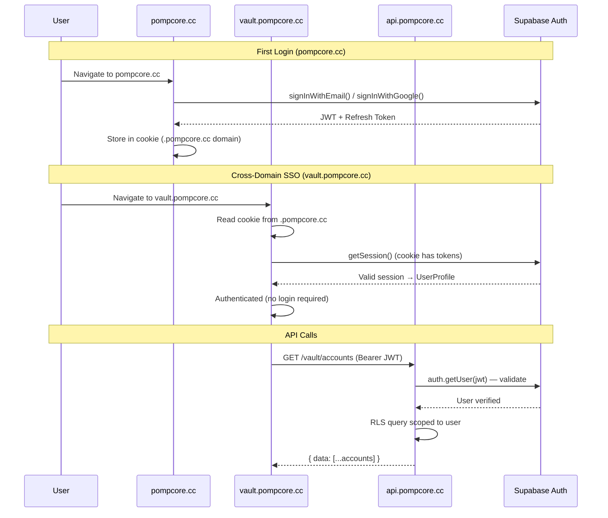
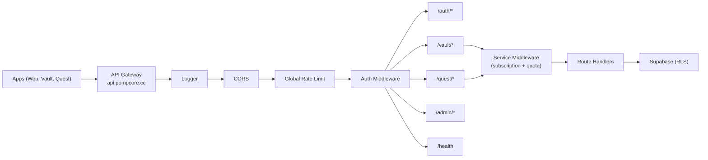
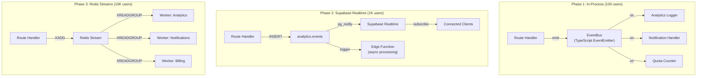

# PompCore SaaS Platform Architecture

## Overview

PompCore is a multi-service platform where each service (Web, Vault, Quest, ...) shares a common identity layer, API gateway, and event bus — but owns its own data schema, business logic, and deployment lifecycle.

This document defines the architecture for scaling from **100 → 1,000 → 10,000 users**.

---

## 1. Multi-Service Platform Model

### Service Registry

Every service is a first-class entity registered in `core.services`. The platform discovers, gates, and meters services through this registry — no hardcoded service lists.

```
┌─────────────────────────────────────────────────────┐
│                   PompCore Platform                  │
│                                                      │
│  ┌──────────┐  ┌──────────┐  ┌──────────┐          │
│  │   Web    │  │  Vault   │  │  Quest   │  ...      │
│  │ (portal) │  │(finance) │  │ (tasks)  │          │
│  └────┬─────┘  └────┬─────┘  └────┬─────┘          │
│       │              │              │                │
│  ─────┴──────────────┴──────────────┴─────────      │
│  │         Shared API Gateway (Hono)         │      │
│  ─────────────────────────────────────────────      │
│       │              │              │                │
│  ┌────┴─────┐  ┌────┴─────┐  ┌────┴─────┐          │
│  │ Identity │  │  Events  │  │Analytics │          │
│  └──────────┘  └──────────┘  └──────────┘          │
│                                                      │
│  ┌──────────────────────────────────────────┐       │
│  │          Supabase (PostgreSQL)            │       │
│  │   core.*    vault.*    analytics.*        │       │
│  └──────────────────────────────────────────┘       │
└─────────────────────────────────────────────────────┘
```

### Service Definition

```sql
-- core.services (existing + config extension)
id          TEXT PRIMARY KEY     -- 'vault', 'quest', 'studio'
name        TEXT NOT NULL
status      TEXT NOT NULL        -- active | beta | maintenance | coming_soon
is_free     BOOLEAN DEFAULT true
config      JSONB DEFAULT '{}'   -- rate_limit, quotas, feature_flags
```

The `config` JSONB column holds per-service settings:

```jsonc
{
  "rate_limit": { "requests_per_minute": 200 },
  "quotas": {
    "free":       { "accounts": 3,  "transactions_per_month": 100 },
    "starter":    { "accounts": 10, "transactions_per_month": 1000 },
    "pro":        { "accounts": -1, "transactions_per_month": -1 },
    "enterprise": { "accounts": -1, "transactions_per_month": -1 }
  },
  "features": {
    "export_csv": ["starter", "pro", "enterprise"],
    "api_access": ["pro", "enterprise"],
    "custom_categories": ["starter", "pro", "enterprise"]
  }
}
```

### Adding a New Service

To add a new service (e.g., Quest), a developer:

1. **Register** — Insert into `core.services`
2. **Schema** — Create `quest.*` PostgreSQL schema with RLS
3. **Routes** — Add `services/api/src/routes/quest.routes.ts`
4. **App** — Create `apps/quest/` (Vite + React)
5. **Types** — Add to `packages/types/src/quest.types.ts`

No changes to core infrastructure, auth, or gateway code required.

---

## 2. Identity Service

### Architecture

PompCore acts as the **Identity Provider (IdP)**. All services are **Relying Parties (RPs)**.



### Identity Boundaries

| Layer | Responsibility | Location |
|-------|---------------|----------|
| **Authentication** | Who is the user? | `@pompcore/auth` (Supabase client) |
| **Session** | Cross-domain persistence | Cookie on `.pompcore.cc` |
| **Authorization** | What can the user do? | Platform roles (`core.profiles.role`) + Org roles (`organization_members.role`) |
| **Subscription** | Which services can they access? | `core.service_subscriptions` |
| **Quota** | How much can they use? | `analytics.service_usage` + `core.services.config` |

### Token Flow

```
┌─────────────┐
│ Supabase JWT │ ← Contains: user_id, email, role, exp
└──────┬──────┘
       │
       ▼
┌──────────────┐     ┌─────────────────┐
│ Cookie Store │────▶│ All *.pompcore.cc│
│ .pompcore.cc │     │ subdomains share │
└──────────────┘     └─────────────────┘
       │
       ▼ (on API call)
┌──────────────────────────────────────┐
│ Authorization: Bearer <jwt>          │
└──────────────┬───────────────────────┘
               │
               ▼
┌──────────────────────────────────────┐
│ API Middleware Chain:                 │
│  1. authMiddleware → verify JWT      │
│  2. serviceMiddleware → check sub    │
│  3. quotaMiddleware → check limits   │
│  4. route handler                    │
└──────────────────────────────────────┘
```

### Role Matrix

**Platform Roles** (global, stored in `core.profiles`):

| Permission | leader | member | user |
|-----------|--------|--------|------|
| view_applications | Y | - | - |
| manage_team | Y | - | - |
| view_project_overview | Y | Y | - |
| view_internal_docs | Y | Y | - |
| use_services | Y | Y | Y |
| manage_profile | Y | Y | Y |

**Organization Roles** (per-org, stored in `organization_members`):

| Capability | owner | admin | member | viewer |
|-----------|-------|-------|--------|--------|
| Manage org settings | Y | Y | - | - |
| Invite/remove members | Y | Y | - | - |
| Access org services | Y | Y | Y | Y |
| View-only access | Y | Y | Y | Y |

---

## 3. Shared API Layer

### Gateway Pattern

A single Hono API gateway handles all service traffic. Routes are namespaced by service.



### Route Registration

```typescript
// services/api/src/routes/index.ts
import { healthRoutes } from './health.routes';
import { authRoutes } from './auth.routes';
import { accountRoutes } from './accounts.routes';
import { transactionRoutes } from './transactions.routes';
// Future services just add a new import:
// import { questRoutes } from './quest.routes';

export function registerRoutes(app: Hono) {
  app.route('/health', healthRoutes);
  app.route('/auth', authRoutes);
  app.route('/vault/accounts', accountRoutes);
  app.route('/vault/transactions', transactionRoutes);
  // app.route('/quest/tasks', questRoutes);
}
```

### Middleware Chain (per-request)

```
Request
  │
  ├─ logger()                    — Log method, path, duration
  ├─ cors()                      — Verify origin whitelist
  ├─ rateLimit(global)           — 200 req/min per IP
  ├─ authMiddleware()            — Verify JWT → c.var.user
  ├─ serviceMiddleware('vault')  — Check subscription + quota
  ├─ requirePermission('use_services')
  │
  └─ routeHandler()              — Business logic
       │
       ├─ createUserClient(jwt)  — RLS-scoped Supabase client
       └─ response               — { data, error, code }
```

### Response Contract

All API responses follow a unified envelope:

```typescript
interface ApiResponse<T> {
  data: T | null;
  error: string | null;
  code?: string;       // machine-readable error code
  meta?: {
    page?: number;
    limit?: number;
    total?: number;
  };
}
```

---

## 4. Event Architecture

### Event Bus Design

Start simple (in-process), scale to distributed when needed.



### Event Schema

```typescript
interface PlatformEvent<T = unknown> {
  id: string;               // UUID
  type: string;             // 'vault.transaction.created'
  source: string;           // service_id: 'vault'
  userId: string;           // who triggered it
  timestamp: string;        // ISO 8601
  data: T;                  // event-specific payload
  metadata?: {
    sessionId?: string;
    ipAddress?: string;
    userAgent?: string;
  };
}
```

### Event Naming Convention

```
{service}.{entity}.{action}

Examples:
  vault.transaction.created
  vault.account.deleted
  vault.budget.threshold_reached
  quest.task.completed
  core.user.role_changed
  core.subscription.upgraded
```

### Event Catalog

| Event | Producer | Consumers | Purpose |
|-------|----------|-----------|---------|
| `core.user.created` | Auth trigger | Analytics, Notification | Welcome flow |
| `core.user.role_changed` | Admin API | Auth sync, Notification | Permission update |
| `core.subscription.upgraded` | Billing | Analytics, Feature gates | Tier change |
| `vault.transaction.created` | Vault API | Analytics, Budget checker | Track usage |
| `vault.budget.threshold_reached` | Budget service | Notification | Alert user |
| `quest.task.completed` | Quest API | Analytics, Gamification | Progress tracking |

### Async Processing Pattern

```
API Handler (sync, fast)
  │
  ├─ Validate input
  ├─ Execute DB operation (RLS)
  ├─ eventBus.emit('vault.transaction.created', data)  ← fire-and-forget
  └─ Return response to client

Event Listeners (async, eventual)
  │
  ├─ analyticsListener → INSERT INTO analytics.events
  ├─ quotaListener → UPDATE analytics.service_usage
  └─ notificationListener → push notification (if threshold)
```

---

## 5. Service Isolation

### Data Isolation

Each service owns a dedicated PostgreSQL schema. No cross-schema JOINs in application code.

```
┌─────────────────────────────────────────────┐
│               Supabase PostgreSQL             │
│                                               │
│  ┌──────────┐  ┌──────────┐  ┌──────────┐   │
│  │  core.*  │  │  vault.* │  │  quest.* │   │
│  │          │  │          │  │          │   │
│  │ profiles │  │ accounts │  │ projects │   │
│  │ orgs     │  │ txns     │  │ tasks    │   │
│  │ services │  │ budgets  │  │ boards   │   │
│  │ subs     │  │ savings  │  │ labels   │   │
│  └──────────┘  └──────────┘  └──────────┘   │
│                                               │
│  ┌──────────────────────────────────────┐    │
│  │           analytics.*                 │    │
│  │  events │ daily_snapshots │ usage    │    │
│  └──────────────────────────────────────┘    │
│                                               │
│  RLS: Every table enforces auth.uid()         │
│  Cross-service data: Only via core.* FKs      │
└─────────────────────────────────────────────┘
```

**Rules:**
1. Service schemas reference `core.*` (profiles, services) but **never** each other
2. Cross-service data flows through the **event bus**, not JOINs
3. Each schema has its own RLS policies scoped to `user_id`
4. The `analytics.*` schema aggregates from all services via `service_id`

### API Isolation

```
services/api/src/
├── routes/
│   ├── auth.routes.ts          ← core (no service gate)
│   ├── health.routes.ts        ← core (no auth)
│   ├── accounts.routes.ts      ← vault service
│   ├── transactions.routes.ts  ← vault service
│   └── quest.routes.ts         ← quest service (future)
├── services/
│   ├── auth.service.ts         ← core business logic
│   ├── account.service.ts      ← vault business logic
│   ├── transaction.service.ts  ← vault business logic
│   └── quest.service.ts        ← quest business logic (future)
└── middleware/
    ├── auth.ts                 ← identity (all routes)
    ├── permissions.ts          ← authorization (role-based)
    ├── service.ts              ← subscription + quota gate
    ├── rateLimit.ts            ← per-IP throttling
    └── cors.ts                 ← origin whitelist
```

Each service's routes apply `serviceMiddleware('vault')` which checks:
1. Does the user have an active subscription to this service?
2. Is the subscription tier sufficient for this operation?
3. Has the user exceeded their quota for this billing period?

### Deployment Isolation (Future)

At scale, services can be extracted into independent deployable units:

```
Phase 1 (Monolith):    Single API process serves all routes
Phase 2 (Modular):     Single API, lazy-loaded route modules
Phase 3 (Microservice): Separate API processes per service behind API gateway

Current: Phase 1 — appropriate for <1K users
```

### Failure Boundaries

| Failure | Blast Radius | Mitigation |
|---------|-------------|------------|
| Vault DB error | Vault routes only | Service-scoped error handler |
| Quest schema migration fails | Quest only | Independent migration files |
| Auth service down | All services | Cached JWT validation (no Supabase call) |
| Event bus backlog | Analytics delayed | Fire-and-forget, async retry |
| Rate limit hit | Single IP | Per-IP, not per-service |

---

## 6. Scaling Roadmap

### Phase 1: 100 Users — Monolith

**Architecture:** Single process, single database, in-memory state.

```
                 ┌──────────────┐
                 │   Vercel /   │
                 │  Railway     │
                 │              │
    pompcore.cc ─┤  apps/web    │
                 │  apps/vault  │
                 │              │
api.pompcore.cc ─┤  services/   │
                 │  api         │
                 │              │
                 │  Supabase    │──── PostgreSQL
                 │  (hosted)    │──── Auth
                 └──────────────┘
```

**Stack:**
- Supabase hosted (free/pro tier)
- Vite apps on Vercel (static hosting)
- Hono API on Railway/Render (single instance)
- In-memory rate limiting
- In-process event bus
- Nightly cron for daily_snapshots (Supabase Edge Function)

**Costs:** ~$25-50/month (Supabase Pro + Railway Starter)

**Key metrics to watch:**
- API response time p95
- Database connection count
- Monthly active users
- Event processing lag

---

### Phase 2: 1,000 Users — Optimized Monolith

**What changes:**
- Rate limiter → Redis-backed (shared state across instances)
- Event bus → Supabase Realtime + Edge Functions
- API → 2-3 instances behind load balancer
- Database → Connection pooling (PgBouncer via Supabase)
- CDN for static assets

```
                ┌──────────────┐
                │ CDN (Vercel) │ ← Static apps
                └──────┬───────┘
                       │
                ┌──────┴───────┐
                │ Load Balancer│
                └──────┬───────┘
                       │
            ┌──────────┼──────────┐
            │          │          │
       ┌────┴───┐ ┌───┴────┐ ┌──┴─────┐
       │ API #1 │ │ API #2 │ │ API #3 │
       └────┬───┘ └───┬────┘ └──┬─────┘
            │         │         │
       ┌────┴─────────┴─────────┴────┐
       │         Redis                │ ← Rate limit, sessions, cache
       └─────────────┬───────────────┘
                     │
       ┌─────────────┴───────────────┐
       │   Supabase (Pro)             │
       │   PgBouncer + PostgreSQL     │
       │   Realtime (event delivery)  │
       │   Edge Functions (async)     │
       └─────────────────────────────┘
```

**New infrastructure:**
- Redis (Upstash serverless — $10/month)
- Supabase Pro with PgBouncer
- 2-3 API instances (Railway Pro or Fly.io)

**Costs:** ~$100-200/month

**Migration checklist:**
- [ ] Replace in-memory rate limiter with Redis adapter
- [ ] Move event bus to Supabase pg_notify + Edge Functions
- [ ] Enable PgBouncer in Supabase dashboard
- [ ] Set up health check monitoring
- [ ] Add Redis caching for service configs and user profiles
- [ ] Set up error tracking (Sentry)

---

### Phase 3: 10,000 Users — Service Extraction

**What changes:**
- Critical services get dedicated API processes
- Event bus → Redis Streams (consumer groups for parallel processing)
- Database → Read replicas for analytics queries
- Background workers for heavy computation
- CDN + edge caching for API responses

```
                    ┌──────────────┐
                    │   CDN Edge   │
                    └──────┬───────┘
                           │
                    ┌──────┴───────┐
                    │ API Gateway  │ ← Nginx / Cloudflare Tunnel
                    └──────┬───────┘
                           │
          ┌────────────────┼────────────────┐
          │                │                │
    ┌─────┴──────┐  ┌─────┴──────┐  ┌─────┴──────┐
    │ Core API   │  │ Vault API  │  │ Quest API  │
    │ (auth,     │  │ (finance)  │  │ (tasks)    │
    │  admin)    │  │            │  │            │
    └─────┬──────┘  └─────┬──────┘  └─────┬──────┘
          │               │               │
          └───────────────┼───────────────┘
                          │
                    ┌─────┴──────┐
                    │   Redis    │ ← Streams, cache, rate limit
                    └─────┬──────┘
                          │
          ┌───────────────┼───────────────┐
          │               │               │
    ┌─────┴──────┐  ┌────┴───────┐  ┌───┴────────┐
    │ Worker:    │  │ Worker:    │  │ Worker:    │
    │ Analytics  │  │ Billing    │  │ Notif.     │
    └────────────┘  └────────────┘  └────────────┘
                          │
          ┌───────────────┼───────────────┐
          │               │               │
    ┌─────┴──────┐  ┌────┴───────┐  ┌───┴────────┐
    │ Primary DB │  │ Read       │  │ Analytics  │
    │ (writes)   │  │ Replica    │  │ DB         │
    └────────────┘  └────────────┘  └────────────┘
```

**New infrastructure:**
- API Gateway (Nginx / Cloudflare Tunnel)
- Dedicated API processes per high-traffic service
- Redis Streams with consumer groups
- Background workers (Bull/BullMQ on Redis)
- PostgreSQL read replica (Supabase Team plan)
- Separate analytics database (optional — ClickHouse/TimescaleDB)

**Costs:** ~$500-1,500/month

**Migration checklist:**
- [ ] Extract Vault API into standalone Hono process
- [ ] Set up API gateway routing (`/vault/*` → Vault API, `/quest/*` → Quest API)
- [ ] Migrate event bus to Redis Streams
- [ ] Add background workers for analytics aggregation
- [ ] Enable read replicas for analytics queries
- [ ] Implement API response caching at edge
- [ ] Set up distributed tracing (OpenTelemetry)
- [ ] Implement circuit breakers between services

---

## 7. Decision Records

### Why Hono (not Express/Fastify)?
- 14kB bundle — deployable to edge runtimes (Cloudflare Workers, Deno Deploy)
- TypeScript-first with type-safe middleware context
- Compatible with Node.js for Phase 1-2, edge for Phase 3+

### Why single API gateway (not microservices from day 1)?
- 100-1K users don't justify the operational overhead
- Monolith → modular monolith → microservices is the proven path
- Service isolation via schemas + middleware achieves 80% of microservice benefits at 20% of the complexity

### Why Supabase (not custom auth)?
- Built-in JWT + OAuth + email auth
- PostgreSQL with RLS = row-level security without application code
- Realtime subscriptions for event delivery
- Edge Functions for serverless async processing
- Managed infrastructure reduces ops burden

### Why Redis Streams (not Kafka/RabbitMQ)?
- Supabase's pg_notify works for Phase 2 with no new infrastructure
- Redis Streams at Phase 3 add consumer groups, persistence, and replay
- Kafka is overkill until 100K+ users with complex event topologies
- Redis serves triple duty: cache + rate limit + event bus

### Why schema-per-service (not database-per-service)?
- Single Supabase project = single connection pool, single billing
- Cross-service foreign keys to `core.*` are simple and reliable
- Schema isolation prevents accidental cross-service queries
- Can extract to separate databases at Phase 3 if needed
